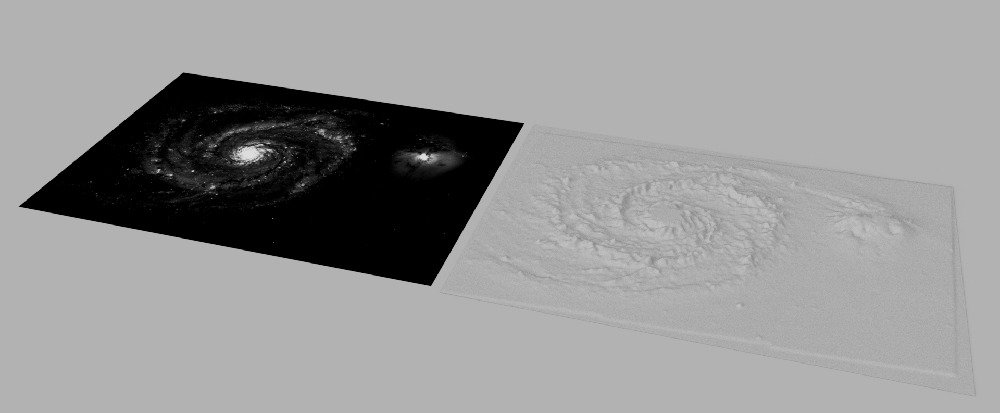
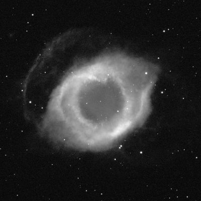
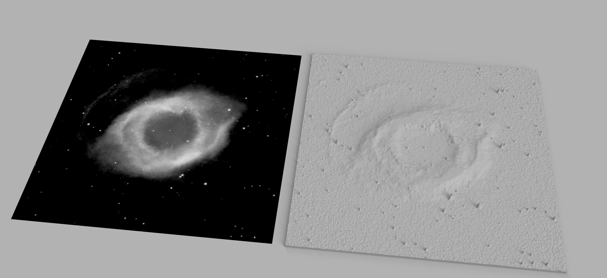
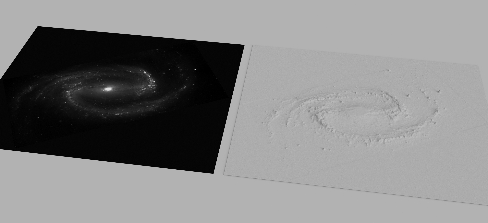

#  AstroTouch 

[](https://opensource.org/licenses/MIT)




Convert astronomical FITS images into 3D printable STL surface relief models, designed primarily for astronomy outreach initiatives for the blind and visually impaired (BVI). This script allows users to transform the brightness variations in a 2D FITS image into height variations on a tangible 3D model.

## Motivation

Astronomical data is overwhelmingly visual. This project aims to bridge that gap by providing a tool to create tactile representations of celestial objects and data, making astronomy more accessible and engaging for individuals who are blind or visually impaired. By feeling the contours, peaks, and valleys corresponding to stars, nebulae, and galaxies, users can gain a different understanding of astronomical structures.

## Features

*   Reads standard 2D FITS image data (`.fits`, `.fit`).
*   Supports compressed FITS files (`.fits.fz`) automatically via `astropy`.
*   Allows selection of the specific HDU containing the image data.
*   **Control Physical Size (`--longest_side`):** Scale the model's *image content* to a specific physical dimension (e.g., 150mm), ensuring predictable print sizes.
*   **Add a Raised Border/Frame (`--border_width_mm`, `--border_height`):** Automatically add a frame around the model with a specific width and height in millimeters. Perfect for creating a finished, tactile plaque.
*   Maps pixel brightness values to surface height (Z-axis).
*   Options for data processing to enhance tactile feel and printability:
    *   **Logarithmic Scaling (`--log_scale`):** Enhances faint features, crucial for most astronomical images.
    *   **Clipping (`--clip`):** Removes extreme outlier pixel values (e.g., saturated stars) before scaling.
    *   **Smoothing (`--smooth`):** Applies Gaussian smoothing to reduce noise and sharp pixel edges for a better tactile feel and improved printability.
    *   **Inversion (`--invert`):** Maps bright pixels to low points (pits) instead of high points (peaks).
    *   **Downsampling (`--downsample`):** Reduces image resolution to simplify the model, speed up processing, and reduce file size.
*   Adds a solid, flat base underneath the surface for print stability.
*   Adjustable maximum feature height (`--max_height`) and base thickness (`--base_thickness`) in millimeters.
*   Handles `NaN`/`inf` values in FITS data by replacing them with a sensible default.
*   Outputs standard STL files compatible with 3D printing slicers (like Cura, PrusaSlicer, etc.).

![A multiwavelength composite of the galaxy Centaurus A, combining data from X-ray, optical, and radio observations. The central image is a full-color composite revealing the galaxy's active core and massive jet structures. The purple glow represents X-ray emissions captured by the Chandra X-ray Observatory, the bright central region and surrounding stars are from optical data collected by the Hubble Space Telescope, and the large blue lobes represent radio emission mapped by the Very Large Array (VLA).

To the right of the composite are three 3D-printed grayscale relief models, each corresponding to one wavelength:

Top: X-Ray (CXRO), showing the hot plasma and energetic structures.
Middle: Optical (HST), displaying stars and the galactic dust lane.
Bottom: Radio (VLA), revealing the extended jets and radio lobes.](multiwavelength.png)

## Example Workflow: Helix Nebula

Here's a workflow example using an observation of the Helix Nebula in Hydrogen-alpha.



**1. Input FITS Image:**

*   **Object:** Helix Nebula (NGC 7293)
*   **Filter:** Hydrogen-alpha (Hα)
*   **Source:** Las Cumbres Observatory (LCO) Global Telescope Network
*   **File:** `coj0m421-sq37-20240612-0129-e91.fits.fz`

**2. Generate STL using recommended options to create a 120mm framed plaque:**

   This command will scale the nebula image to 120mm on its longest side, then add a 5mm wide, 2mm high border around it.

   ```bash
   python3 fits_to_stl.py coj0m421-sq37-20240612-0129-e91.fits.fz helix_plaque.stl --hdu 1 --longest_side 120 --log_scale --clip 1 --smooth 2.0 --downsample 2 --border_width_mm 5 --border_height 2.0
   ```

**3. 3D Print the Model:**



## Installation

### Prerequisites

*   Python 3.7+
*   `pip` (Python package installer)
*   Git (for cloning the repository)

### Steps

1.  **Clone the repository:**
    ```bash
    git clone https://github.com/enzoperesafonso/AstroTouch.git
    cd AstroTouch
    ```

2.  **Create a virtual environment (Recommended):**
    ```bash
    python -m venv venv
    # Activate the environment:
    # On Windows: venv\Scripts\activate
    # On macOS/Linux: source venv/bin/activate
    ```

3.  **Install dependencies:**
    ```bash
    pip install -r requirements.txt
    ```

## Usage

Run the script from your terminal (make sure your virtual environment is active):

```bash
python fits_to_stl.py <input_fits_file> <output_stl_file> [options]
```

### Required Arguments

*   `<input_fits_file>`: Path to the input FITS file (e.g., `image.fits`).
*   `<output_stl_file>`: Path where the output STL file will be saved (e.g., `model.stl`).

### Optional Arguments

See `python fits_to_stl.py --help` for a full list and defaults. Key options include:

*   `--hdu INDEX` (Default: `0`, often need `1` for processed telescope images)
*   `--longest_side MM`: Scales the *image content* so its longest side matches this value in mm. The final model will be larger if a border is added.
*   `--max_height MM` (Default: `10.0`): Maximum height of the features above the base.
*   `--base_thickness MM` (Default: `2.0`)
*   `--border_width_mm MM` (Default: `0.0`): Adds a border of this width around the model.
*   `--border_height MM` (Default: `0.0`): Sets the height of the border, measured from the base.
*   `--invert`: Inverts the height map.
*   `--log_scale`: Applies log(1+x) scaling to enhance faint details.
*   `--clip PERCENT` (Default: `1.0`): Clips the lowest and highest percentile of pixels.
*   `--smooth SIGMA` (Default: `0`): Applies Gaussian smoothing. A value of `1.0` to `2.0` is recommended for tactile models.
*   `--downsample FACTOR` (Default: `1`): Reduces image resolution by this factor.

### Command Line Examples

1.  **Basic conversion (likely needing HDU 1):**
    ```bash
    python fits_to_stl.py my_image.fits.fz my_model.stl --hdu 1
    ```

2.  **Recommended starting point for a good tactile model:**
    This command focuses on enhancing details and ensuring printability without setting a specific size.
    ```bash
    python fits_to_stl.py nebula.fits nebula_tactile.stl --hdu 1 --log_scale --clip 1.0 --smooth 1.5 --max_height 12.0
    ```
3.  **Creating a finished, framed plaque with a specific size:**
    This creates a model where the galaxy image is 150mm on its longest side, surrounded by a 10mm wide, 3mm high frame.
    ```bash
    python fits_to_stl.py galaxy.fits galaxy_plaque.stl --hdu 1 --longest_side 150 --log_scale --clip 0.5 --smooth 2 --border_width_mm 10 --border_height 3
    ```

## Tips for Effective Models

*   **For Tactile Feel:** Use `--log_scale` to bring out faint structures. Use `--smooth` (`1.0` to `2.5`) to make surfaces less noisy and more pleasant to touch. Use `--clip` to prevent single bright stars from creating sharp, unpleasant spikes.
*   **For Framing:** Use `--border_width_mm` and `--border_height` to create a finished look. A border height of `0` creates a flat flange, while a positive value creates a raised wall.
*   **For 3D Printing:** Use `--smooth` (crucial for printability!). Ensure `--base_thickness` is at least `2.0` mm. In your slicer: **use a Brim** for bed adhesion, **do not use supports** on the tactile surface, and consider PLA filament.

## Troubleshooting
*   **"My model is flat" or "Looks like noise":** You likely need to specify the correct HDU with `--hdu 1`. FITS files from telescopes often store the image in the second extension.
*   **"My print is stringy/messy":** You need more smoothing. Try `--smooth 1.5` or higher.
*   **"The model lifts off the print bed":** Use a Brim in your slicer settings. A 5-8mm brim is usually sufficient.
*   **"Processing is too slow" or "STL file is huge":** The image resolution is very high. Use `--downsample 2` or `--downsample 4` to make it more manageable.

## Connect & Share

AstroTouch was born from a passion for astronomy outreach and the belief that educational tools should be open and accessible to all. The goal is to help educators, astronomers, and enthusiasts share the wonders of the universe in a tangible way.

In the spirit of open-source collaboration:

*   **If you use this code for your own outreach projects, 3D prints, or educational materials, I would be thrilled to hear about it!** Seeing how these tools are used in the real world is the greatest reward.
*   **If you have questions, ideas, or need a hand getting started, please don't hesitate to reach out.**

You can connect in a couple of ways:

*   **For technical questions or suggestions,** please [open an issue](https://github.com/enzoperesafonso/AstroTouch/issues) on this GitHub repository.
*   **To share your creations** or see other astronomy outreach in action, follow and message our outreach group (ask for enzo!) on Instagram: **[@zulelinye](https://www.instagram.com/zulelinye/)**.

Let's make the universe a little more tangible for everyone, together.

## License

This project is licensed under the MIT License - see the [LICENSE](LICENSE) file for details.

## Acknowledgements

*   This tool relies heavily on [Astropy](https://www.astropy.org/), [NumPy](https://numpy.org/), [SciPy](https://scipy.org/), and [NumPy-STL](https://github.com/WoLpH/numpy-stl/).



