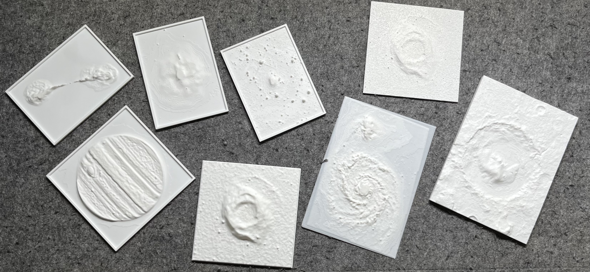
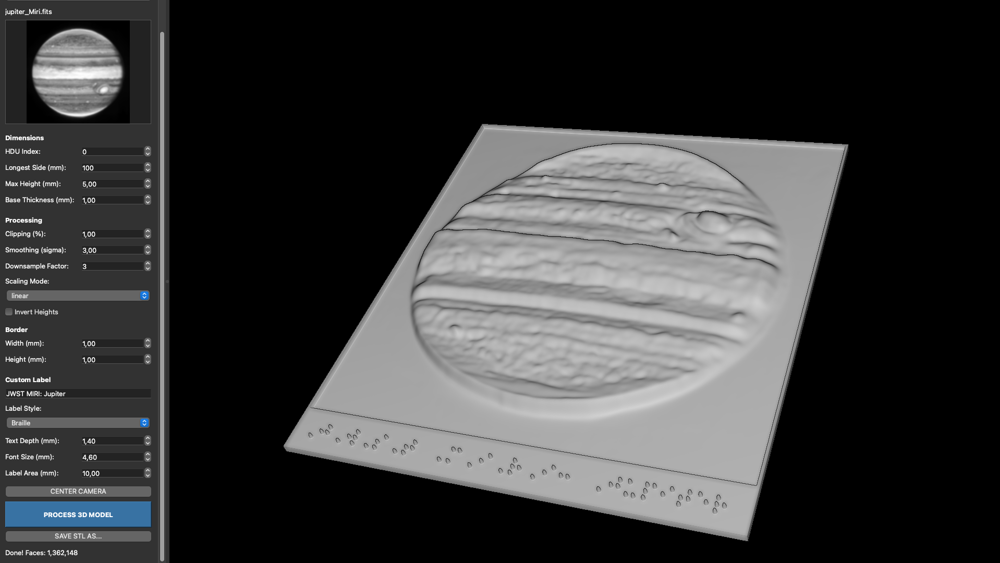
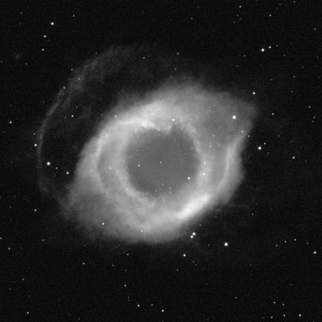
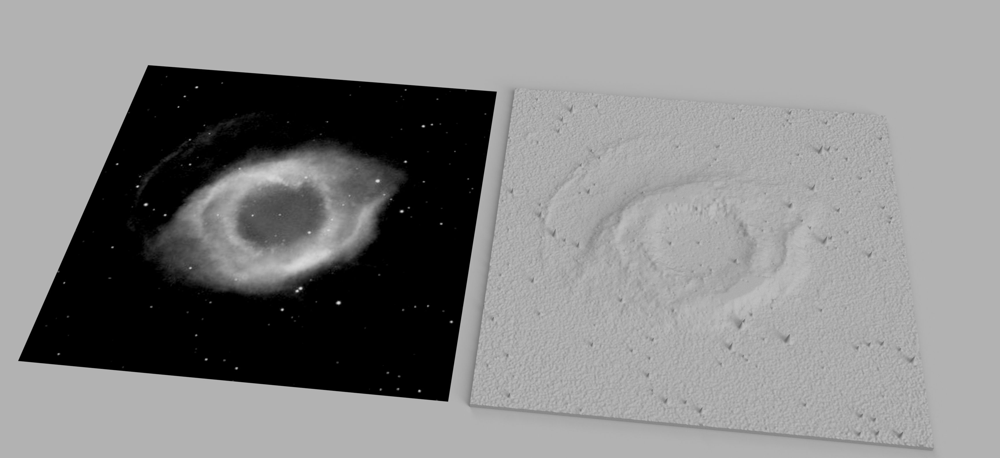

# AstroTouch
AstroTouch transforms astronomical FITS images into 3D-printable STL relief models. Designed primarily for astronomy outreach for the blind and visually impaired (BVI), it allows anyone to feel the universe by turning brightness data into tactile contours.


---

## AstroTouch Desktop GUI

AstroTouch features a powerful, interactive desktop application that lets you preview and customize your 3D models in real-time.



### GUI Features
*   Real-time 3D Preview: View your model immediately after generation.
*   Tactile Labeling: Add custom raised text or Unified English Braille (UEB) labels.
*   Dedicated Label Areas: Extend the model base to create a flat, easy-to-read surface for labels.
*   Interactive Controls: Adjust scaling, clipping, smoothing, and borders with instant feedback.
*   One-Click Save: Export your finalized model directly to STL.

---

## Key Engine Features

*   UEB Braille Support: Fully compliant Unified English Braille translation, including capitalization indicators and punctuation.
*   Smart Scaling: Choose between Linear, Logarithmic, or Arcsinh scaling to bring out the best detail in your data.
*   Auto-HDU Detection: Smartly identifies the correct 2D image data within complex multi-extension FITS files.
*   Tactile Optimization: Built-in Gaussian smoothing and clipping to ensure models are comfortable to touch and easy to print.
*   High Performance: Vectorized mesh generation engine for rapid processing of high-resolution images.

---

## Installation

### Prerequisites
*   Python 3.8 or higher.
*   A 3D printer (or a slicer like Cura/PrusaSlicer to view the models).

### Steps
1.  Clone the repository:
    ```bash
    git clone https://github.com/enzoperesafonso/AstroTouch.git
    cd AstroTouch
    ```
2.  Install dependencies:
    ```bash
    pip install -r requirements.txt
    ```

---

## Usage

### Desktop GUI
Launch the interactive interface:
```bash
python gui.py
```

### Command Line Interface (CLI)
For batch processing or advanced workflows:
```bash
python cli.py input.fits [output.stl] [options]
```

#### CLI Parameters

| Argument | Type | Default | Description |
| :--- | :--- | :--- | :--- |
| `input` | Path | (Required) | Path to the input FITS file. |
| `output` | Path | input.stl | Path to the output STL file. |
| `--hdu` | Int | Auto | HDU index containing the 2D image data. |
| `--longest-side` | Float | None | Scale the longest side of the image content to this size in mm. |
| `--max-height` | Float | 10.0 | Maximum height of astronomical features above the base (mm). |
| `--base-thickness`| Float | 2.0 | Thickness of the solid base plate (mm). |
| `--clip` | Float | 1.0 | Percentile to clip outlier pixels (e.g. 1.0 clips top/bottom 1%). |
| `--smooth` | Float | 0 | Gaussian smoothing sigma in pixels (e.g. 1.5). |
| `--downsample` | Int | 1 | Factor to reduce image resolution (e.g. 2 halves dimensions). |
| `--nan-value` | Float | Min | Value to replace NaNs with. |
| `--log` | Flag | False | Apply log(1+x) scaling (ideal for high dynamic range). |
| `--asinh` | Flag | False | Apply arcsinh scaling (common in astronomical imaging). |
| `--invert` | Flag | False | Invert heights (brightest pixels become lowest points). |
| `--border-width` | Float | 0.0 | Width of a raised frame around the model (mm). |
| `--border-height`| Float | 0.0 | Height of the border frame above the base (mm). |
| `--label` | String | "" | Custom text for the tactile label. |
| `--label-mode` | String | text | Style of label: `text` or `braille`. |
| `--label-depth` | Float | 1.5 | Height/thickness of the raised label characters (mm). |
| `--label-size` | Float | 5.0 | Font size/scale of the label characters (mm). |
| `--label-area` | Float | 0.0 | Width of dedicated flat area at the bottom for the label (mm). |
| `--verbose` | Flag | False | Enable detailed logging. |

---

## Example Workflow: Helix Nebula

This example demonstrates how to create a high-quality tactile plaque of the Helix Nebula.



1.  **Command:**
    Generate a 120mm plaque with logarithmic scaling, a protective border, and a UEB Braille label in a dedicated area.

    ```bash
    python cli.py helix.fits helix_tactile.stl \
      --longest-side 120 \
      --log \
      --clip 1 \
      --smooth 1.5 \
      --border-width 5 \
      --border-height 2 \
      --label "Helix Nebula" \
      --label-mode braille \
      --label-area 15
    ```

2.  **Result:**
    The engine produces an STL file with a 120mm core, a 5mm frame, and a 15mm flat section at the bottom containing the Braille dots for "Helix Nebula".



---

## Project Structure

*   `gui.py`: Desktop GUI launcher.
*   `cli.py`: Command Line Interface launcher.
*   `src/astrotouch/`: Core logic and UI source code.
*   `assets/`: Documentation images and example data.
*   `tests/`: Verification scripts.

---

## Motivation

Astronomical data is overwhelmingly visual. This project aims to bridge the gap by providing a tool to create tactile representations of celestial objects and data, making astronomy more accessible and engaging for individuals who are blind or visually impaired. By feeling the contours, peaks, and valleys corresponding to stars, nebulae, and galaxies, users can gain a different understanding of astronomical structures.

---

## License
This project is licensed under the MIT License - see the [LICENSE](LICENSE) file for details.

By **Enzo Peres Afonso** (2025).
